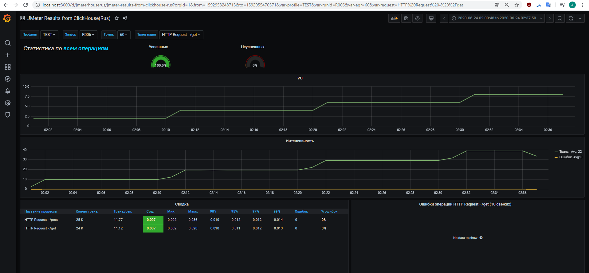

# beeline-task
Jmeter load test

Для запуска нагрузочного теста необходимо выполнить следующие пункты
(запуск команд осуществляется из директории проекта, для запуска необходим `docker` и `maven`):
1. Запуск сервисов: 
    * clickhouse, 
    * grafana, 
    * testingservice (нагружаемый сервис).
    
    команда:
    `docker-compose up`
2. Запуск теста (beeline-task/src/test/jmeter/test_1.jmx):

    Текущий тест запустится с id R001.
    
    команда:
    `mvn verify`
    
3. Результаты теста отображаются в графане, запущенной на `localhost:3000`

dashboard: _JMeter Results from ClickHouse(Rus)_

Нагружаемый ресурс запущен на `localhost:80`

Clickhouse - `localhost:8123`
